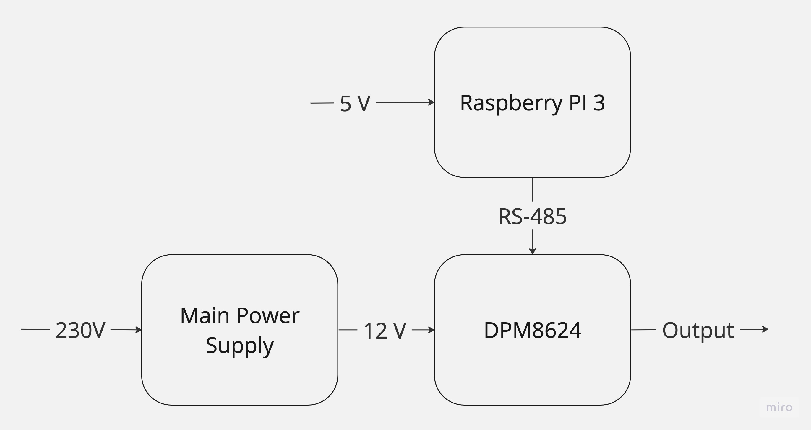

# Introduction
This is a library to controll a DPM8624 powersupply.

For testing there is a charger.py script. With that script you can charge Batteries for testing.



# How to use


Create a virtual environment first.
```
python3 -m venv <venv-name>
```

Activate the environment
```
source <venv-name>/bin/activate
```
Install the requirements.
```
pip install -r requirements.txt
```
